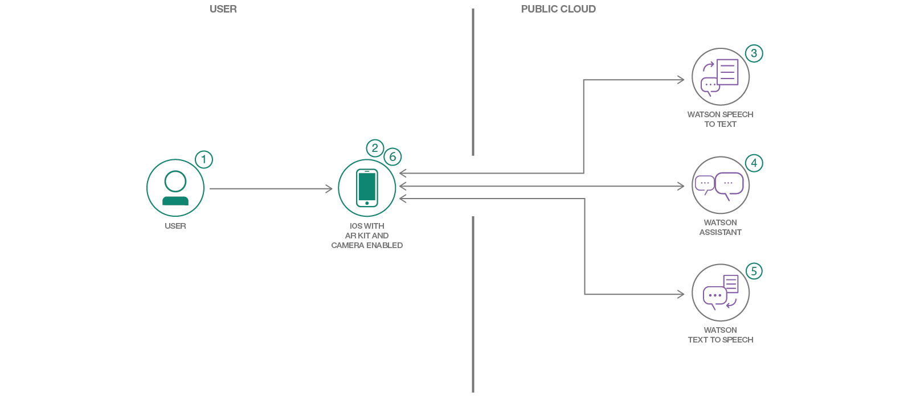

# Build an AI Powered AR Character in Unity with ARKit

In this Code Pattern we will use [Assistant](https://www.ibm.com/watson/developercloud/conversation.html), [Speech-to-Text](https://www.ibm.com/watson/developercloud/speech-to-text.html), and [Text-to-Speech](https://www.ibm.com/watson/developercloud/text-to-speech.html) deployed to an iPhone with ARKit to have a voice-powered animated avatar in Unity.

Augmented reality allows a lower barrier to entry for both developers and end-users thanks to framework compatibility in phones and digital eyewear. 

When the reader has completed this Code Pattern, they will understand how to:

* Add IBM Watson Speech-to-Text, Assistant, and Text-to-Speech to Unity with ARKit to create an augmented reality experience.

## Flow

1. User interacts in augmented reality and gives voice commands such as "Walk Forward".
2. The iPhone microphone picks up the voice command and the running application sends it to Watson Speech-to-Text.
3. Watson Speech-to-Text converts the audio to text and returns it to the running application on the iPhone.
4. The application sends the text to Watson Assistant. Watson assistant returns the recognized intent "Forward". The intent triggers an animation state event change.
5. The application sends the response from Watson Assistant to Watson Text-to-Speech.
6. Watson Text-to-Speech converts the text to audio and returns it to the running application on the iPhone.
7. The application plays the audio response and waits for the next voice command.

<!--
# Watch the Video
TODO: MAKE VIDEO
-->

## Included components

* [IBM Watson Assistant](https://www.ibm.com/watson/developercloud/conversation.html): Create a chatbot with a program that conducts a conversation via auditory or textual methods.
* [IBM Watson Speech-to-Text](https://www.ibm.com/watson/developercloud/speech-to-text.html): Converts audio voice into written text.
* [IBM Watson Text-to-Speech](https://www.ibm.com/watson/developercloud/speech-to-text.html): Converts written text into audio.

## Featured technologies

* [Unity](https://unity3d.com/): A cross-platform game engine used to develop video games for PC, consoles, mobile devices and websites.
* [Unity ARKit Plugin](): A Unity plugin for ARKit functionality to create augmented reality experiences on iPhones.

# Steps

1. [Before you begin](#1-before-you-begin)
2. [Create IBM Cloud services](#2-create-ibm-cloud-services)
3. [Building and Running](#3-building-and-running)

## 1. Before You Begin

* [IBM Cloud Account](http://ibm.biz/Bdimr6)
* [Unity](https://unity3d.com/get-unity/download)

## 2. Create IBM Cloud services

On your local machine:
1. `git clone https://github.com/IBM/Watson-Unity-ARKit.git`
2. `cd Watson-Unity-ARKit`

In [IBM Cloud](https://console.ng.bluemix.net/):

1. Create a [Speech-To-Text](https://console.ng.bluemix.net/catalog/speech-to-text/) service instance.
2. Create an [Assistant](https://console.ng.bluemix.net/catalog/services/conversation/) service instance.
3. Create a [Text-to-Speech](https://console.ng.bluemix.net/catalog/text-to-speech/) service instance.
4. Once you see the services in the Dashboard, select the Assistant service you created and click the  button.
5. After logging into the Assistant Tool, click the  button.
6. Import the Assistant [`voiceActivatedMotionSimple.json`](data/voiceActivatedMotionSimple.json) file located in your clone of this repository.

## 3. Building and Running

> Note: This has been compiled and tested using Unity 2018.2.9f1 and Watson Unity SDK from the Unity Asset Store version v2.10.0 as of October 15, 2018 and tested with the `develop` branch of the github unity-sdk as of `commit 68f4497 Oct 10`.

> Note: If you are in *any* IBM Cloud region other than US-South you *must* use Unity 2018.2 or higher. This is because Unity 2018.2 or higher is needed for TLS 1.2, which is the only TLS version available in all regions other than US-South.

1. Download the [Watson SDK for Unity](https://github.com/watson-developer-cloud/unity-sdk) or perform the following:

`git clone https://github.com/watson-developer-cloud/unity-sdk.git`

Make sure you are on the develop branch.
1. Open Unity and inside the project launcher select the  button.
1. Navigate to where you cloned this repository and open the `Creation Sandbox` directory.
1. If prompted to upgrade the project to a newer Unity version, do so.
1. Follow [these instructions](https://github.com/watson-developer-cloud/unity-sdk#getting-the-watson-sdk-and-adding-it-to-unity) to add the Watson Unity SDK downloaded in step 1 to the project.
1. Follow [these instructions](https://github.com/watson-developer-cloud/unity-sdk#configuring-your-service-credentials) to create your Speech To Text, Text to Speech, and Watson Assistant services and find their credentials (using [IBM Cloud](https://console.bluemix.net)
 You can find your workspace ID by selecting the expansion menu on your assistant workspace and selecting `View details`.

    

1. In the Unity Hierarchy view, click to expand under `GroundPlane`, click `DefaultAvatar`.
1. In the Inspector you will see Variables for `Speech To Text`, `Text to Speech`, and `Assistant` and either `CF Authentication` for the Cloud Foundry username and password, or the `IAM Authentication` if you have the IAM apikey. Since you only have only one version of these credentials, fill out only one of the two for each service.
1. Fill out the `Speech To Text Service Url`, `Text to Speech Service Url`, the `Assistant Service Url`, the `Assistant Workspace Id`, and the `Assistant Version Date`.

1. To Build for iOS and deploy to your phone, you can _File_ -> _Build_ Settings (Ctrl + Shift +B) and click Build.
1. When prompted you can name your build. 
1. When the build is completed, open the project in Xcode by clicking on `Unity-iPhone.xcodeproj`.
1. Follow [steps](https://help.apple.com/xcode/mac/current/#/dev60b6fbbc7) to sign your app. Note - you must have an Apple Developer Account.
1. Connect your phone via USB and select it from the target device list at the top of Xcode. Click the play button to run it.
1. Alternately, connect the phone via USB and _File_-> _Build and Run_ (or Ctrl+B).

  
# Links

<!--* TODO ADD VIDEO LINK-->
* [Watson Unity SDK](https://github.com/IBM/unity-sdk)

# Troubleshooting

AR features are only available on iOS 11+ and can not run on an emulator/simulator. Be sure to check your player settings to target minimum iOS device of 11, and your Xcode deployment target (under deployment info) to be 11 also.

In order to run the app you will need to sign it. Follow steps [here](https://help.apple.com/xcode/mac/current/#/dev60b6fbbc7).

# Learn more

* **Artificial Intelligence Code Patterns**: Enjoyed this Code Pattern? Check out our other [AI Code Patterns](https://developer.ibm.com/code/technologies/artificial-intelligence/).
* **AI and Data Code Pattern Playlist**: Bookmark our [playlist](https://www.youtube.com/playlist?list=PLzUbsvIyrNfknNewObx5N7uGZ5FKH0Fde) with all of our Code Pattern videos
* **With Watson**: Want to take your Watson app to the next level? Looking to utilize Watson Brand assets? [Join the With Watson program](https://www.ibm.com/watson/with-watson/) to leverage exclusive brand, marketing, and tech resources to amplify and accelerate your Watson embedded commercial solution.

# License

This code pattern is licensed under the Apache Software License, Version 2.  Separate third party code objects invoked within this code pattern are licensed by their respective providers pursuant to their own separate licenses. Contributions are subject to the [Developer Certificate of Origin, Version 1.1 (DCO)](https://developercertificate.org/) and the [Apache Software License, Version 2](http://www.apache.org/licenses/LICENSE-2.0.txt).

[Apache Software License (ASL) FAQ](http://www.apache.org/foundation/license-faq.html#WhatDoesItMEAN)
